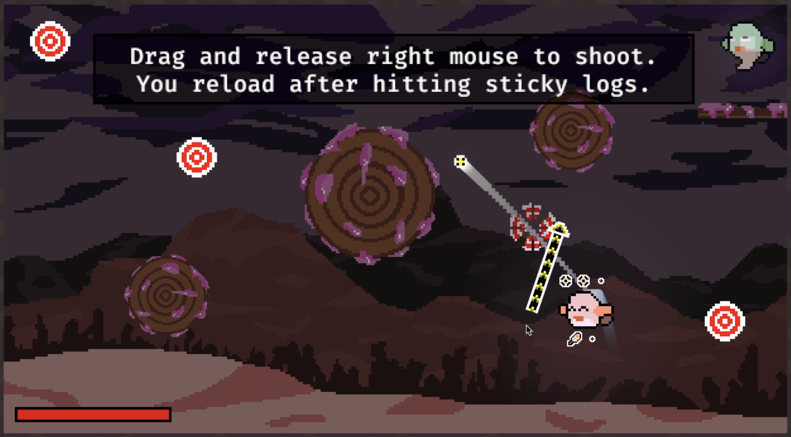
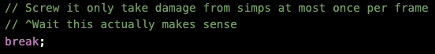
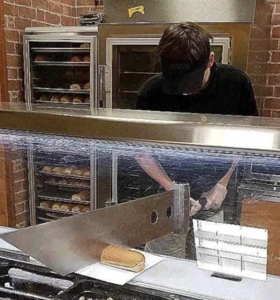
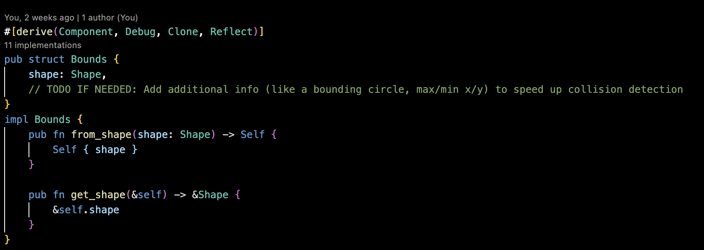

# What I Learned From Doing [Bevy Jam 5](https://itch.io/jam/bevy-jam-5)


<!--  -->

[Bevy](https://bevyengine.org/learn/quick-start/introduction/) Jam 5 wrapped up a couple weeks ago, and I've finally paid off enough of my sleep debt to (hopefully) write a coherent article about what I learned. I've divided up my thoughts into three sections:

1. Non-technical learnings = thoughts on game dev and game design in general.
2. Technical learnings = specific patterns I experimented with in Bevy, and some specific comments on the new features in 0.14.[^1]
3. Abrupt Conclusion

Shameful plug: I ended up submitting a game called [Starling](https://mfpekala.itch.io/starling). Play it! It'll make this article make much more sense. You can find the code [here](https://github.com/mfpekala/starling). (If you're interested in my technical learnings, it's probably worth at least glancing at the code. Plus it's got some sleep deprivation induced gems, like the screenshot below.)


<!--  -->

# 1. Non-Technical Learnings

⚠️ This section actually ended up being a little technical. Whoops. Enjoy! ⚠️

## Game Jams are The Best Way to Get Better at Making Games

Before the jam, I had put a few months of part-time work into another game [Zenith](https://www.mark-pekala.dev/posts/zenith-devlog-1) ([code](https://github.com/mfpekala/zenith)). Before that, I was pretty new to rust and completely new to Bevy and was working on a totally different game [Pupil](https://github.com/mfpekala/pupil), which is complete garbage.

Despite the fact that I've put probably 5x the amount of hours in Zenith compared to Starling, I think I've learned a similar amount of "stuff" from each of them. It's perhaps a little unfair of a comparison because a big chunk of Zenith's early dev was still getting used to Bevy, and also Bevy 0.14 (used in Starling but not Zenith) introduced [Computed States](https://docs.rs/bevy/latest/bevy/state/prelude/trait.ComputedStates.html#:~:text=Trait%20bevy%3A%3Astate%3A%3Aprelude%3A%3AComputedStates&text=A%20computed%20state%20is%20a,result%20becomes%20the%20state's%20value.) which replaced a custom macro I put an embarrassing amount of time in to. But still.

I think this would probably be true regardless of what tools I was using to make the game because a game jam forces you to think differently. Being put on a tight deadline discourages you from over-generalizing, and forces you to "complete" most parts of the game. It's all about finding something kind-of-fun to play, then tying up all the loose ends you normally ignore, like menuing, engaging sound effects & music, a tight game loop, etc.

It also forces you to ignore things that you (or at least, _I_) often get distracted by. Some specific lessons here:

**Don't hyper-focus on performance prematurely.**

Don't get me wrong, performance matters. You need to ship a game that can comfortably hit 30+ FPS even on weak devices (mobile, WASM). But looking back on the time I put into Zenith, specifically the animation system, I wrote and rewrote big chunks not because I needed to (the game was hitting 100+ FPS) but because I thought it was fun to make the animation stuff go brrr. The physics system in Starling is embarassingly naive. And it works great.

<!--  -->


_Using Bevy, an engine designed for high-performance 3D games, to make a simple 2D game and THEN spending 80% of your time working on performance stuff even though it's already hitting 150 fps._

<!--  -->


_See? Embarassingly simple. I never needed this complex shit I thought I might, even with a few hundred hitboxes._

**Don't hyper-focus on making internal APIs perfect.**

Game dev, compared to the "real" software engineering I've seen in my limited experience, has noticeably fewer "clean" abstractions. Games, somewhat by nature, are filled with edge cases, one-off animations, and little goodies which are basically impossible to put behind a clean API that doesn't have a million knobs. I'm so used to making things with every ounce of abstraction squeezed out of them that I'm sometimes blind to fact that I should just accept this component might only be used to do one narrow thing and that this is actually the cleanest solution.

During the game jam there were a couple times when I would come up with some custom system for handling something and think, "Wow this API I built for this thing sucks. I can't believe I actually have to use this everywhere." Then I would use it in a few places and think, "Oh, this actually isn't that bad." Once again the animation manager is a good example. I wrote a pretty cursed [macro here](https://github.com/mfpekala/starling/blob/main/src/macros.rs) and immediately hated myself for wasting four hours on it. But it was fine, and did not get in the way at all of releasing something I can be proud of.

## Sound Effects are Always More Important than I Think

I somewhat realized this with Zenith, but was bashed over the head with it when making Starling. These days, I actually don't really play video games that often, but when I do, I don't feel like I ever really notice the sound effects. Sure, they're there, but they're not something I focus on or remember.

But oh my god adding sound effects to Starling (specifically collision sounds) made it feel soooo much better. There was this pretty surreal moment where after adding my first sound effect (the bird hitting something) and tuning it to scale with the bird's speed, the rest of the game felt eerily quiet and incomplete. Why doesn't Lenny make a sound when he shoots? Why don't the enemies make any noise when they die? It made me remember that while at first glance game dev — at least to me — is about making something fun, it's really about building a world that someone else wants to be in.

## Free Assets are Good

I have this dream where I'm an indie dev that wakes up, spends a couple hours writing godly code, then casually pulls out a MIDI keyboard and drops an absolute banger. But its just that. A dream. It's never going to happen.

In reality, OpenGameArt has tons of great stuff, especially in the sound effect / music space which should be more than enough for any game I could reasonably hope to publish in the next few years. I'm now somewhat of the belief that unless you _really_ enjoy making an asset, and _genuinely think_ you can make good stuff, it's not worth making. At least to start! It's much more productive to plug in something that's already pretty polished, then come back to it later if it feels off.

This is especially helpful in the early stages of a game, where coming up with the first few assets is especially daunting. To make a first asset that actually feels good, you would probably need to have a complete vision of what the game would be on day 1, which is impossible. Throw something in that works and come back to it.

## Balance is Hard (Probably O(2^n) hard naively)

What I mean is that by having n features that might make the game "harder" balancing the game feels like turning n switches either on or off and seeing how hard it feels. Predicting how hard something will be just by looking at the switches feels impossible. Except maybe it's a little worse because the switches are probably actually knobs that are arbitrary floats, but maybe that's easier because you can just put everything around 0.5 times the maximum sane value and hope it's okay? Moral of the story is that balance is hard, and sneaks up on you fast if your not careful.

For example, take Starling. It's a super simple game. Only two enemy types and one kind of platform to interact with. But there's probably around 60 floats that contribute pretty directly to how hard the game feels. To name a few:

- Flight speed (a bunch floats because each horizontal/vertical is tuned twice, once for acceleration and once for deceleration, plus drag)
- Launch speed
- Bullet speed
- Enemy AI (4 floats in current implementation)
- Enemy spawn locations
- Enemy spawn timers (like 8 floats somehow)
- Enemy hitbox sizes (a few floats)
- Bullet time slowdown multiplier
- ... (the list goes on and on)

There's also meta things like when to spawn the enemy types at the same time, or whether certain physics interactions are bugs or features.

I found when developing the game that changing one of these values, even from 0.06 to 0.05, could completely change how the whole thing felt.

I honestly don't really have a solution to this right now. On some level it probably is the case that to make a really really good game you have to play it O(2^n) times to really master the "feel".

But with better dev practices (a.k.a. sampling) I bet there's good heuristics I could use to get the complexity within P. I remember hearing in an [interview](https://www.youtube.com/watch?v=RcquK6CIh14&list=PLSmdYkYmn1XrkkHzgSbwNr9mP5r8P94Xs&index=2) with [Deepnight Games](https://deepnight.net/about/) that the developers of Dead Cells targeted a "Kill Time" heuristic. Basically they decided every kill in the game should take either 1 second or 3 seconds depending on the risk. Things like this that cut down the design space would probably make it a lot easier to balance.

I also regret with Starling that I didn't really think about balance at all until the game was finished. To be fair, it's hard to know how to balance the game when the core features are missing, but I'm sure I could've done at least a little better.[^2]

## Getting Actual Feedback is Crucial

Actually hitting publish on Itch.io and watching other people play my game was super rewarding. At present writing this (two weeks-ish after the jam) it's still a big motivator — I want other people to play my stuff again.

Also, it's also obvious to say (or write) but people will always find things that need improving that I shrug off. In Starling it was fullscreen support and better preview indicators.

## Polish and Ease of Use Matters

I used to work as mobile engineer, and it always baffled me how much time went into things that happened when the user first opened the app. Sometimes it felt like 50+% of engineering effort (across the entire team) was dedicated to the users first 5 seconds in the app, even though most sessions are 5+ minutes. Sometimes this is fun stuff (good 'ol performance engineering) but a lot of it seems tedious. Where should this button be? How do we hit the goldilocks amount of notifications to shove in their face? Can we see which of these 40 logos leads to more engagement? It honestly made me a little cynical about full-stack dev in general.

But now that I'm a bit older with more experience it makes so much sense. People have really, really short attention spans. If they are confused or bored or overwhelmed they will not give you a second chance. Unless they're you're friend, and maybe not even then, they will give up when they hit their first bump.

I really focused on polish for Starling (competant tutorial, satisfing spawn/play/death game loop with transitions). I think this paid off in the comments I've received, and is certainly a way to make your game stand out in a jam where many games won't even have controls listed and will feel like a "find the magic button to make your character do stuff" minigame.[^3]

# 2. Technical Learnings

## Bevy 0.14 States and Computed States Upgrades are Awesome

States in Bevy are a way of handling kind-of meta things about the game, like if the player is in a menu, paused, watching a cutscene, etc...

The biggest upside of states (imo) is that you get access to these super nice and fancy `OnEnter` and `OnExit` schedules that run — you guessed it — on enter and on exit. The idea being that you could use these to say, actually spawn the pause menu, or load a level, or what not at the exact time you need without having some system that runs every frame polling an Event which 99.9% of frames has no updates.

Sounds nice, right?

Kind-of.

Consider this reasonable looking game state:

```rust

struct RoomState {
    room_size: UVec2,
    num_enemies: u32,
}

enum MenuState {
    TitleScreen,
    LevelSelect,
}

enum GameState {
    Room(RoomState),
    Menu(MenuState),
}
```

Before Bevy 0.14, you could add this as a game state, but if you wanted to use `OnEnter`, you'd have to specify an exact `GameState`. I.e. you'd have to write:

```rust
// This looks fine (really nice, actually)
app.add_systems(
    OnEnter(GameState::Menu(MenuState::TitleScreen)),
    spawn_menu,
)
// Hmmmm this seems... odd
app.add_systems(
    OnEnter(GameState::Room(RoomState {
        // Why do I have to specify the exact room size here???
        room_size: UVec2::new(100, 100),
        num_enemies: 10,
    }))
    spawn_level,
)
```

This works great for `GameState::Menu` variants. But what about rooms? What if you enter a game state with a different room size of number of enemies? This system doesn't run.

Before Bevy 0.14, the solution would have been to add some totally unrelated type like this:

```rust
enum MetaGameState {
    Room,
    Menu,
}
```

then what you should really do is add systems to `OnEnter` of `MetaGameState::Room`, oh and also it's your responsibility to make sure `MetaGameState` and `GameState` are in-sync even though they store the same data and if they ever go out of sync your game is 100% going to explode.

I found this limitation pretty discouraging. In fact for Zenith (written in 0.13), I just implemented my own game state system. I really don't like duplicating the same state in multiple places without strict guarantees that they won't get out of whack.

But Bevy 0.14 saves the day! It adds these things called computed states, which basically still use the `MetaGameState` struct as in the example above, but which adds in-engine guarantees that the `MetaGameState` you observe will be updated when the base `GameState` changes according to some arbitrary function.

I found Computed States to be the exact thing I was looking for to make state management easy without tons of spinner systems reading events that rarely fire. You can check out [`src/state/mod.rs`](https://github.com/mfpekala/starling/blob/main/src/state/mod.rs) for (almost) all the state used by the app. It's a surprising amount, but I think super readable and easy to reason about with the new system.

## Bevy 0.14 Hooks and Observers Were... Not My thing

One of the big things in Bevy 0.14 (at least from the perspective of a 2D dev) were hooks and observers. The draw from hooks is that you could respond immediately to component lifecycle events (i.e. component added, modified, removed) to help maintain correctness gaurantees. The draw from observers is that you could trigger complex logic immediately, with an `Event` like API that listens instead of polling.

But I found these to just kind of cloud up the logic. For example, if you doing complex maintence logic in a lifecycle hook of a component, it becomes kind of hard to reason about when important stuff is happening in an entity that contains that component along with other components. When you write the same logic as part of a system, that `Query` type probably contains some component reference `&mut T`, but also `&mut P` and `&mut Q` which are the sibling component types which exist on relevant entities and are actually being updated. In this way it's much easier (I think) to glance at a system that is responsible for general world maintainence then a combination of hooks on components. Hooks feel like a band-aid solution to a problem that might be better solved with systems and better schedule ordering.

Triggers felt slightly more useful than hooks. In my head, triggers seem like a stricly superior api to one-shot systems (I imagine under the hood they're probably pretty similar). It basically lets you write systems like you normally would but have those systems run infrequently with different input. Pretty cool. I don't think the final Starling code actually had any observers at the end of the jam (they got replaced with more expressive OnEnter/OnExit for `States` and `ComputedStates`), but fun to play around with. I can definitely see them being useful.

## Custom Macros May Be the Secret Sauce

Compared to other game-making tools, Bevy at times feels pretty verbose. Take for example a single input to my system updating animations:

```rust
/// Basically mutably selects some parts of a child which is responding to parent data
mut bodies: Query<
    (
        Entity,
        &Parent,
        &AnimationBodyMarker,
        &mut AnimationMap,
        &mut AnimationData,
        &mut Transform,
        &mut Visibility,
        &Mesh2dHandle,
        &Handle<AnimationMaterial>,
    ),
    Without<AnimationStable>,
>,
```

It's now been awhile since I've written `C++`, but in `C++` this perhaps could just be

```C++
// As some system parameter
AnimationParent* anim_parent
...
// In some loop
anim_parent.children[ix].advance_frame();
```

On some level, this is frustrating. In C/C++/C# I might just take in some scary pointer to this thing, directly have a pointer to it's child, and mutate away.

But this verbosity has benefits too. For one, once you get used to reading it, it's incredibly precise. Just from this snippet, I can tell exactly what data is going to be modified, and what data isn't. I can plug in additional components with ease. It's also safe. Assuming I didn't do anything crazy, if this system compiles and can be added to the app, it's not going to crash randomly. It's going to just work. I'd personally rather spend time writing precise queries than shadow-boxing `gdb`.

But maybe I can have my cake and eat it to with custom macros! That is, still have the core logic use verbose types that are performant, readable, and safe, but have the game code and level definitions interact with it through simple macros.

I found this most helpful with my animation system.[^4] Here's what the most complex animated entity in the game (Lenny) ended up looking like at spawn time:

```rust
multi: multi!([
    (
        "core",
        anim_man!({
            normal: {
                path: "lenny/fly.png",
                size: (24, 24),
                length: 3,
                fps: 16.0,
            },
            taking_damage: {
                path: "lenny/fly_damage.png",
                size: (24, 24),
                length: 3,
                fps: 12.0,
            }
            dead: {
                path: "lenny/fly_damage.png",
                size: (24, 24),
                length: 3,
                // I'm so lazy
                fps: 0.0,
            }
        })
        .with_offset(Vec3::new(-1.0, 0.0, 0.0))
    ),
    (
        "light",
        anim_man!({
            path: "lenny/spotlight.png",
            size: (48, 48),
            length: 1,
        })
        .with_render_layers(LightCamera::render_layers())
        .with_scale(Vec2::new(2.5, 2.5))
    ),
]),
```

Look! It's even expressive enough to have an `// I'm so lazy` hack abusing fps-zero `AnimationBody`s!

Custom macros also in some weird way helped me think in more data-first way. When writing the above macro(s) I found myself asking, "Okay what is literally every piece of data I need to render animations on Lenny" and then asking "how do I organize this to make sense?" and then finally "how do I convey this in as few characters as possible?" All in all by the time I had a macro syntax I liked, it was pretty obvious what the components and bundles should be.

The biggest downside (to me at least) is that macros feel kind of fragile and hard to change. You're probably writing something with syntax that goes out of rust/bevy land, and if you found you made a mistake, it's a bit more cumbersome to change then just refactoring something that derives bundle.

**A brief aside**

I think a lot of pain that these custom macros ease will go away once the [UI and Scene Evolution Proposal](https://github.com/bevyengine/bevy/discussions/9538) lands. Most of the super super verbose stuff comes from defining simple hierarchies or "styling" like things that get applied to detail-like components on entities. But guess what? The secret sauce in this proposal? It's a macro.

```rust
// A UI example of where the unified scene macro may be helpful
fn setup() -> Bsn {
    bsn! {
        Div { width: 10 height: 100 } [
            Img { handle: "branding/icon.png" }
            Div {
                width: 100
                height: 200
            }
            @("player.bsn")
        ]
    }
}
```

# Abrupt Conclusion

What did I learn? A lot. Hopefully you did too.

---

[^1] - It's worth noting that I pretty much exclusively work on 2D-games, and most people that are excited about Bevy are excited about much more ambitious 3D-games. I'm using it because it's fun and I like rust, not because it's the best tool for the job.

[^2] - I genuinely have no idea if Starling is even remotely balanced. I think rooms 1-5 feel... okay? I've heard it's way too hard, way too easy, but who knows. It probably doesn't help that the game itself is a bit janky with some pretty questionable physics "features". Beyond room 8 it is completely unknown whether it's even playable. Maybe all the more reason to play it and find out? ;)

[^3] - Fun related anecdote: my LinkedIn url is customized to be `cargo-run`. Many people who see my resume don't notice or care, but this extra bit of polish actually matters a lot. I've gotten at least 3 interviews from people who explicitly told me they flagged my resume because of this url. Obviously I didn't get all of those jobs (or even make it past the first round) but that little bit of polish that makes your thing different from all the other things is insanely valuable.

[^4] - Why does it seem like I learned everything from doing animations? I think probably because ergonomic 2d animations (with state machines) are kind of hard to do and have pretty poor support in Bevy atm (imo). I had to do a lot myself from relatively bare-bones pieces, at least compared to other off-the-shelf bevy things like `Transform`s and `Mesh`es.
